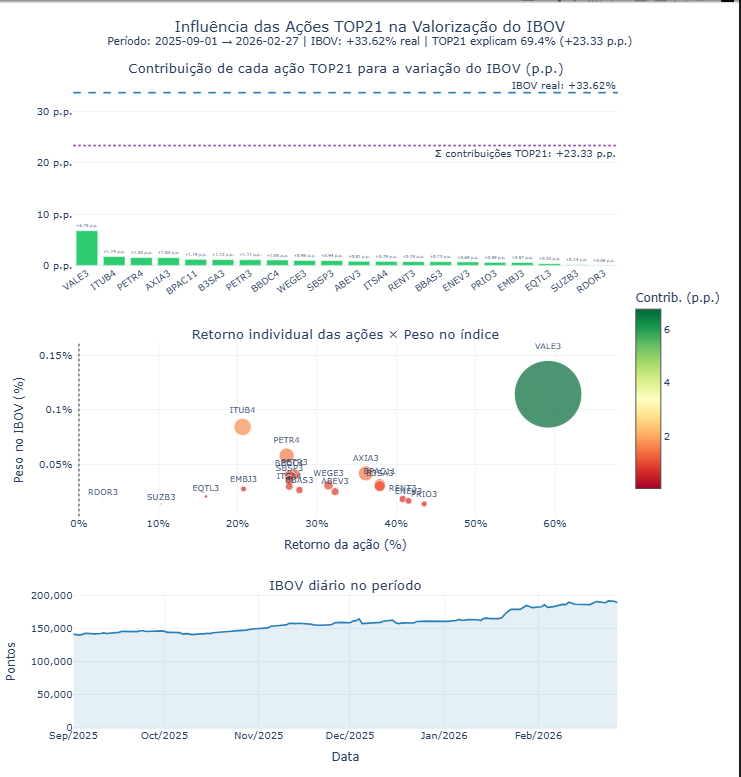

# Projeto B3 Data Analysis - Análise Exploratória de dados da B3

## Descrição

Este projeto realiza análise exploratória e visualização de dados da Bolsa de Valores Brasileira (B3), focando no índice IBOV (Índice Bovespa) e nas ações que o compõem. O notebook principal `B3_analiseDadosV3.ipynb` analisa a influência das 21 ações TOP do IBOV na variação do índice, utilizando dados históricos de cotações e rankings mensais.

O ojetivo era verificar o porquê do aumento agressivo do indice IBOV de setembro de 2025 para 2026. No entanto, ao aprofundar um pouco mais na quantidade de dados disponibilizados pela B3, foi-se estendendo mais, a análise, e tem uma série de questões e inclusive técnicas, por exemplo, usando pandas e pyarrow/parquet mostrando a abismal diferença de tempo de execução de rotinas/funções.

O projeto calcula retornos diários, correlações, retornos acumulados e gera gráficos interativos com Plotly para ilustrar a contribuição das ações TOP no desempenho do IBOV. Isto, além de outras 'perguntas', como foi a variação da quantidade de ações (ON e PN) ao longo dos últimos 20 anos, como foi o comportamento do volume financeiro, etc.etc. Tem dados da participação estrangeira na bolsa na pasta '\b3_analysis\b3-relatoriosDadosMercadoDaB3', etc,etc,etc

"FIRST THINGS FIRST": Para iniciar deve fazer o download dos arquivos históricos COTAHIST da B3 (zipados) e colocar na pasta 'b3_zip' (link está abaixo). Aqui só alguns arquivos para demonstrar como ficam as pastas 'populadas' com dados.

## Estrutura do Projeto

```
B3_dataV2/
├── B3_analiseDadosV3.ipynb          # Notebook principal com análises e gráficos
├── README.md                  # Este arquivo
├── b3_analysis/
│   ├── acoesTop20_cotacoes/
│   │   ├── top2526/           # Cotações diárias das TOP 21 ações (2025-2026)
│   │   └── ibov_indice2025-2026.csv  # Dados do IBOV
│   └── b3_rankingTop20/       # Rankings mensais das TOP 20 ações do IBOV
├── b3_csv/                    # primeira pasta a ser populada com dados (descompactados dos zip da B3 para 'b3_data')
│   ├── b3_data/               # Dados gerais da B3 em CSV
│   ├── b3_ibov/
│   │   └── ibovEvolucaoDiaria_brcsv/  # Evolução diária do IBOV (2010-2026), entre outras pastas e informações
│   ├── mercado_acaoONPNBR/    # Mercado de ações ON/PN/BR
│   ├── mercado_avista/        # Mercado à vista
│   ├── mercado_bdr/           # Mercado de BDRs
│   ├── mercado_FIIs/          # Mercado de Fundos Imobiliários
│   ├── mercado_frac/          # Mercado fracionário
│   ├── mercado_outros/        # Outros mercados
│   └── mercado_units/         # Mercado de units
├── b3_parquet/                # Dados em formato Parquet  ('espelho' do csv)                (*obs: 1)
├── b3_pickle/                 # Dados serializados em Pickle ('espelho' do csv)
├── b3_zip/                    # Arquivos ZIP originais - COTAHIST - downloads da B3  (*obs: 2)
└── b3_logs/                   # Logs de execução
```

(*1) arquivos parquet e pickle são criados por funções disponíveis no jupyter notebook ( só precisa dos 'zipados' da B3)

(*2) arquivos 'zip' COTAHIST_Axxxx.zip disponíveis em:
logs históricos da B3 (com opções: série anual ou mensal ou diária) estão disponíveis em (usei anual):
https://www.b3.com.br/pt_br/market-data-e-indices/servicos-de-dados/market-data/historico/mercado-a-vista/series-historicas/


## Dados Utilizados para o cáculo da influência das TOP 20 no índice IBOV

- **Rankings mensais do IBOV**: Arquivos CSV com códigos das ações e porcentagens no índice (ex.: `rk_ibov202509.csv` para setembro 2025).
- **Cotações diárias das ações**: Arquivos CSV com data (`DATAPREG`) e preço de fechamento (`PREULT`) para cada ação TOP.
- **Evolução diária do IBOV**: Arquivos CSV com pontos diários do índice, organizados por mês.

Período analisado: Principalmente de setembro 2025 a fevereiro 2026.

## Notebook B3_analiseDadosV3.ipynb

### Visão Geral
O notebook é dividido em células que carregam dados, processam cálculos e geram visualizações. Ele usa bibliotecas como Pandas, pyArrow, Plotly e NumPy para manipulação e gráficos.

### Principais Seções

1. **Imports e Configurações**: Carrega bibliotecas necessárias (pandas, plotly, etc.) e define timezone.

2. **Carregamento de Pesos (TOP 21)**: Lê o ranking de fevereiro 2026 (`rk_ibov202602.csv`) para obter pesos das ações no IBOV.

3. **Carregamento de Cotações**: Carrega preços diários das 21 ações TOP da pasta `top2526`.

4. **Carregamento do IBOV**: Processa arquivos de evolução diária para obter série temporal do índice.

5. **Cálculos de Retornos**:
   - Retornos diários das ações e do IBOV.
   - Retorno ponderado das TOP 21 (baseado nos pesos).

6. **Gráficos**:
   - **Retorno Acumulado**: Compara IBOV vs. portfólio TOP 21.
   - **Diferença Acumulada**: Mostra contribuição das ações fora do TOP 21.
   - **Correlação Scatter Plot**: Retornos diários com linha de regressão.
   - **Gráfico de Influência (Subplots)**: Barras de contribuição, scatter retorno vs. peso, e linha do IBOV diário.

### Como Executar

1. **Pré-requisitos**: (também tem o arquivo requirements.yml do ambiente que usei - não precisa de 'tudo isso', mas...)
   - Python 3.8+
   - Ambiente Conda: `conda activate D:\conda_envs\python2026-torchStream`
   - Bibliotecas: pandas, plotly, numpy, pyarrow, polars, yfinance (instale com `pip install` se necessário).

2. **Execução**:
   - Abra o notebook no VS Code ou Jupyter Lab.
   - Execute as células sequencialmente (algumas células podem demorar devido ao processamento de dados).
   - Os gráficos são interativos e exibidos inline.

3. **Saídas**:
   - Gráficos Plotly interativos.
   - Prints de correlações e estatísticas.

### Interpretações dos Gráficos

- **Retorno Acumulado**: Mostra se as TOP 21 acompanham o IBOV (alta correlação esperada, ~70% do índice).
- **Correlação**: Scatter plot com linha OLS; coeficiente próximo a 1 indica forte influência.
- **Influência**: Quantifica quanto cada ação contribuiu para a variação do IBOV em pontos percentuais.

## Dependências

- pandas
- plotly
- numpy
- pyarrow
- polars
- yfinance
- matplotlib (opcional)

Instale com pip ou anaconda: (Obs: ainda não testei, mas quero brevemente testar o Marimo e uv, para substituir anaconda, conda, pip e jupyter):

```
pip install pandas plotly numpy pyarrow polars yfinance matplotlib
```


## Licença

Este projeto é para fins de compartilhar conhecimento e é livre para usar, copiar, etc. Dados da B3 são públicos.

## Conclusão

A análise no notebook `B3_analiseDadosV3.ipynb` demonstra que as 21 ações TOP do IBOV, representando aproximadamente 70% do índice, têm uma forte influência em sua variação. Os gráficos mostram correlações elevadas e contribuições significativas, com VALE3 e ITUB4 sendo destaques em peso e impacto.

Para visualizar o resultado final, execute a última célula do notebook, que gera o gráfico de influência completo:



*Imagem: Gráfico interativo com subplots mostrando contribuição das ações, retorno vs. peso e evolução do IBOV (captura de tela do Plotly).*

